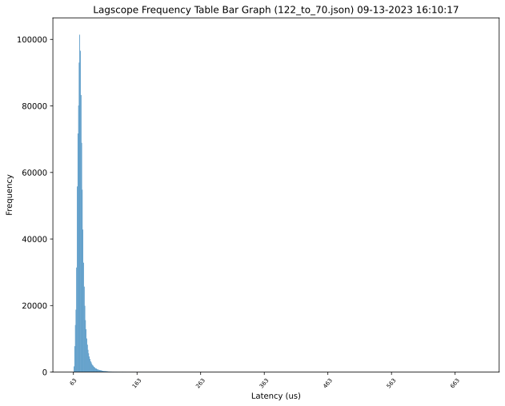
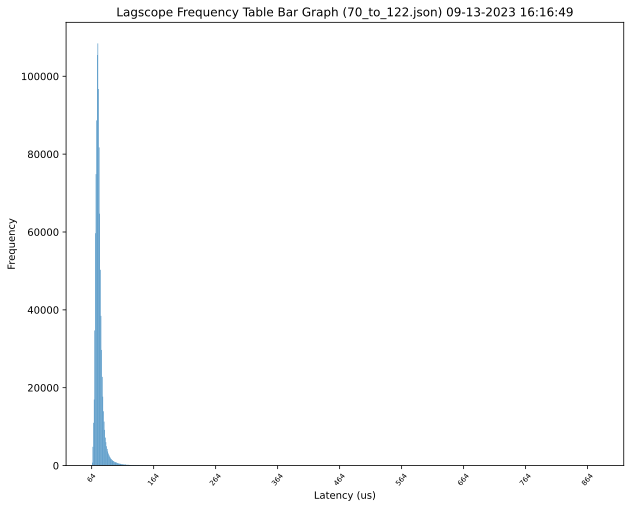
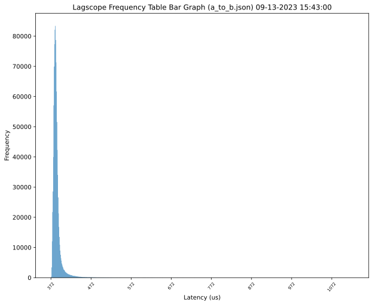
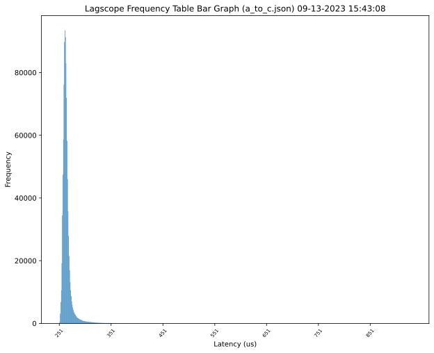
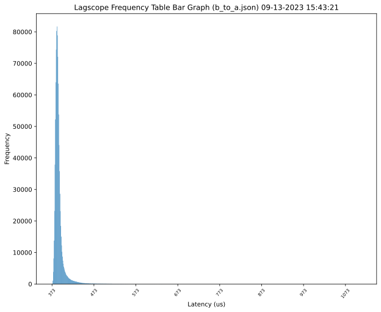
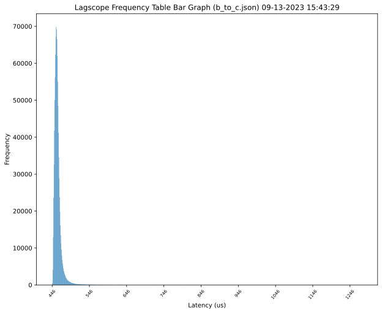
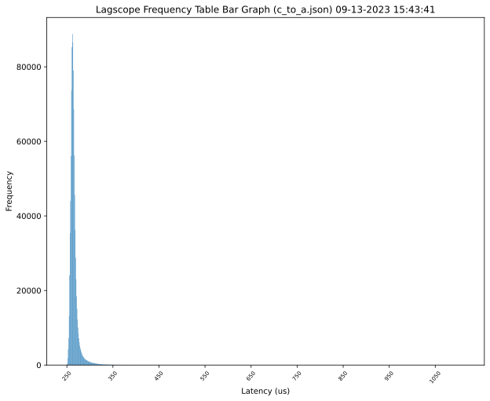
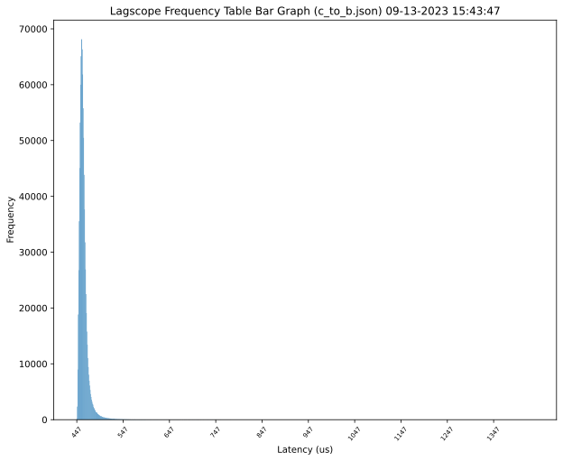

_Overview._ Some data point on network latencies between VMs hosted in the same region/AZ vs. VMs
hosted in the same region/distinct AZs.

| Region    | OS           | VM SKU    | Tools                                             |
| --------- | ------------ | --------- | ------------------------------------------------- |
| eu-west-1 | Ubuntu 22.04 | c5.xlarge | [lagscope](https://github.com/microsoft/lagscope) |

```bash
> terraform init
> terraform apply
```

# Single-AZ

Under the deployment used:

| Private IP   | AZ           |
| ------------ | ------------ |
| `10.0.0.122` | `eu-west-1a` |
| `10.0.1.70`  | `eu-west-1a` |

## 10.0.0.122 -> 10.0.1.70



```
> lagscope -s10.0.1.70 -P122_to_70.json
lagscope 1.0.1
---------------------------------------------------------
14:59:29 INFO: New connection: local:25001 [socket:3] --> 10.0.1.70:6001
15:00:45 INFO: TEST COMPLETED.
15:00:45 INFO: Ping statistics for 10.0.1.70:
15:00:45 INFO: 	  Number of successful Pings: 1000000
15:00:45 INFO: 	  Minimum = 63.250us, Maximum = 700.000us, Average = 75.364us
15:00:45 INFO: Dumping latency frequency table into json file: 122_to_70.json

Percentile	 Latency(us)
     50% 	 74
     75% 	 77
     90% 	 81
     95% 	 86
     99% 	 102
   99.9% 	 142
  99.99% 	 207
 99.999% 	 302
```

## 10.0.1.70 -> 10.0.0.122



```
> lagscope -s10.0.0.122 -P70_to_122.json
lagscope 1.0.1
---------------------------------------------------------
15:09:09 INFO: New connection: local:25001 [socket:3] --> 10.0.0.122:6001
15:10:26 INFO: TEST COMPLETED.
15:10:26 INFO: Ping statistics for 10.0.0.122:
15:10:26 INFO: 	  Number of successful Pings: 1000000
15:10:26 INFO: 	  Minimum = 64.500us, Maximum = 881.500us, Average = 76.273us
15:10:26 INFO: Dumping latency frequency table into json file: 70_to_122.json

Percentile	 Latency(us)
     50% 	 74
     75% 	 78
     90% 	 82
     95% 	 87
     99% 	 105
   99.9% 	 156
  99.99% 	 262
 99.999% 	 560
```

# Multi-AZ

Under the deployment used:

| Private IP   | AZ           |
| ------------ | ------------ |
| `10.0.0.42`  | `eu-west-1a` |
| `10.0.1.193` | `eu-west-1b` |
| `10.0.2.209` | `eu-west-1c` |

## eu-west-1a -> eu-west-1b



```
> lagscope -s10.0.1.193 -Pa_to_b.json
lagscope 1.0.1
---------------------------------------------------------
13:40:19 INFO: New connection: local:25001 [socket:3] --> 10.0.1.193:6001
13:46:46 INFO: TEST COMPLETED.
13:46:46 INFO: Ping statistics for 10.0.1.193:
13:46:46 INFO: 	  Number of successful Pings: 1000000
13:46:46 INFO: 	  Minimum = 372.750us, Maximum = 1126.250us, Average = 386.743us
13:46:46 INFO: Dumping latency frequency table into json file: a_to_b.json

Percentile	 Latency(us)
     50% 	 384
     75% 	 388
     90% 	 394
     95% 	 403
     99% 	 439
   99.9% 	 528
  99.99% 	 676
 99.999% 	 932
```

## eu-west-1a -> eu-west-1c



```
> lagscope -s10.0.2.209 -Pa_to_c.json
lagscope 1.0.1
---------------------------------------------------------
13:48:09 INFO: New connection: local:25001 [socket:3] --> 10.0.2.209:6001
13:52:35 INFO: TEST COMPLETED.
13:52:35 INFO: Ping statistics for 10.0.2.209:
13:52:35 INFO: 	  Number of successful Pings: 1000000
13:52:35 INFO: 	  Minimum = 251.250us, Maximum = 930.250us, Average = 265.586us
13:52:35 INFO: Dumping latency frequency table into json file: a_to_c.json

Percentile	 Latency(us)
     50% 	 263
     75% 	 267
     90% 	 272
     95% 	 279
     99% 	 311
   99.9% 	 380
  99.99% 	 450
 99.999% 	 584
```

## eu-west-1b-> eu-west-1a



```
> lagscope -s10.0.0.42 -Pb_to_a.json
lagscope 1.0.1
---------------------------------------------------------
13:59:38 INFO: New connection: local:25001 [socket:3] --> 10.0.0.42:6001
14:06:09 INFO: TEST COMPLETED.
14:06:09 INFO: Ping statistics for 10.0.0.42:
14:06:09 INFO: 	  Number of successful Pings: 1000000
14:06:09 INFO: 	  Minimum = 373.750us, Maximum = 1110.000us, Average = 389.622us
14:06:09 INFO: Dumping latency frequency table into json file: b_to_a.json

Percentile	 Latency(us)
     50% 	 386
     75% 	 390
     90% 	 398
     95% 	 408
     99% 	 448
   99.9% 	 538
  99.99% 	 671
 99.999% 	 858
```

## eu-west-1b-> eu-west-1c



```
> lagscope -s10.0.2.209 -Pb_to_c.json
lagscope 1.0.1
---------------------------------------------------------
14:09:36 INFO: New connection: local:25001 [socket:3] --> 10.0.2.209:6001
14:17:18 INFO: TEST COMPLETED.
14:17:18 INFO: Ping statistics for 10.0.2.209:
14:17:18 INFO: 	  Number of successful Pings: 1000000
14:17:18 INFO: 	  Minimum = 446.000us, Maximum = 1278.250us, Average = 461.115us
14:17:18 INFO: Dumping latency frequency table into json file: b_to_c.json

Percentile	 Latency(us)
     50% 	 459
     75% 	 463
     90% 	 469
     95% 	 476
     99% 	 504
   99.9% 	 584
  99.99% 	 702
 99.999% 	 931
```

## eu-west-1c -> eu-west-1a



```
> lagscope -s10.0.0.42 -Pc_to_a.json
lagscope 1.0.1
---------------------------------------------------------
14:21:48 INFO: New connection: local:25001 [socket:3] --> 10.0.0.42:6001
14:26:14 INFO: TEST COMPLETED.
14:26:14 INFO: Ping statistics for 10.0.0.42:
14:26:14 INFO: 	  Number of successful Pings: 1000000
14:26:14 INFO: 	  Minimum = 250.500us, Maximum = 1113.250us, Average = 265.769us
14:26:14 INFO: Dumping latency frequency table into json file: c_to_a.json

Percentile	 Latency(us)
     50% 	 263
     75% 	 267
     90% 	 273
     95% 	 281
     99% 	 309
   99.9% 	 375
  99.99% 	 485
 99.999% 	 870
```

## eu-west-1c -> eu-west-1b



```
> lagscope -s10.0.1.193 -Pc_to_b.json
lagscope 1.0.1
---------------------------------------------------------
14:27:41 INFO: New connection: local:25001 [socket:3] --> 10.0.1.193:6001
14:35:24 INFO: TEST COMPLETED.
14:35:24 INFO: Ping statistics for 10.0.1.193:
14:35:24 INFO: 	  Number of successful Pings: 1000000
14:35:24 INFO: 	  Minimum = 447.000us, Maximum = 1433.500us, Average = 461.813us
14:35:24 INFO: Dumping latency frequency table into json file: c_to_b.json

Percentile	 Latency(us)
     50% 	 459
     75% 	 464
     90% 	 471
     95% 	 478
     99% 	 505
   99.9% 	 586
  99.99% 	 721
 99.999% 	 933
```
